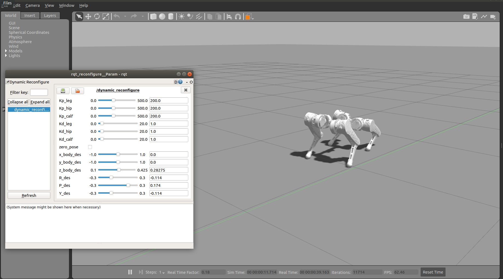
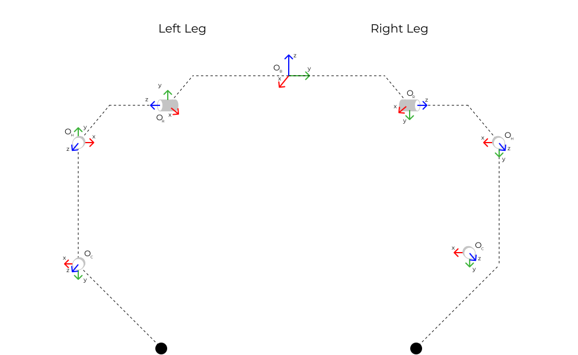

# quadruped_inno
Simulation of quadruped for Thesis Project


<!--  -->


# Kinematics Scheme




# How to run

## CoM control (feet are fixed on the ground)
If you want to use ROS simulation:

```bash
roslaunch quadruped_control robot_torque(pos)_control.launch
```
But make sure that flag "use_ros" in file /quadruped_control/scripts/control_body_P_RPY.py is equal to "True"


If you want to use the real hardware with TMOTORS:

```bash
python3 control_body_P_RPY.py
```
But make sure that flag "use_ros" in file /quadruped_control/scripts/control_body_P_RPY.py is equal to "False"


Also, after execution, the program will create csv file which you can analyze with help of cvs_analysis.py file (lies in /quadruped_control/scripts/)

...update...

\<TO DO>
* identificate robot parameters (Is, masses, etc)
* MPC for walking
